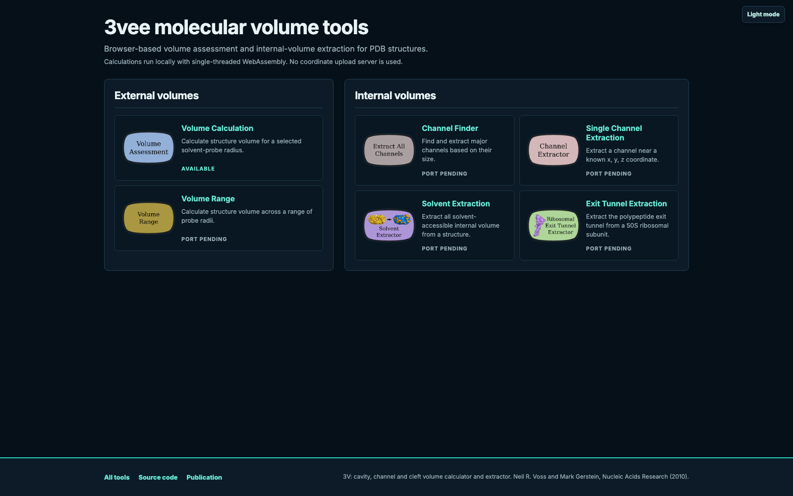
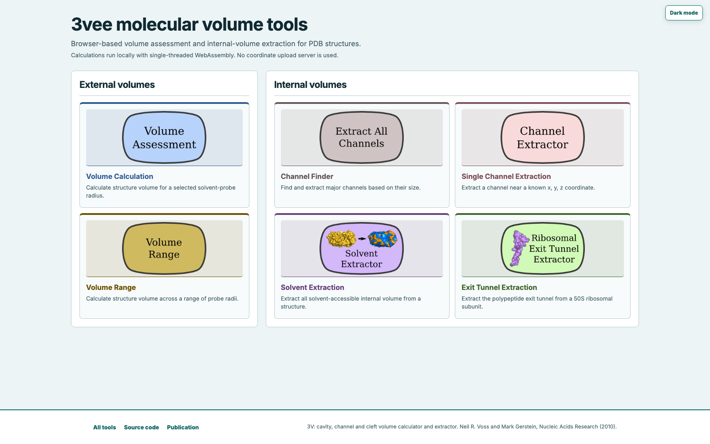
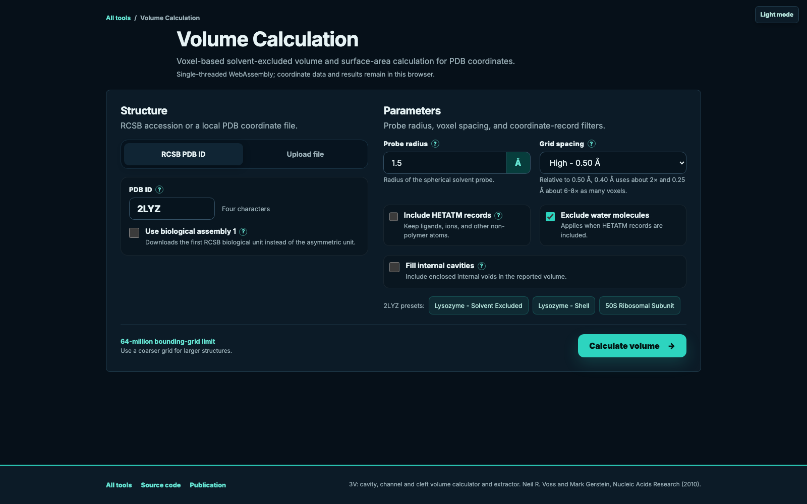
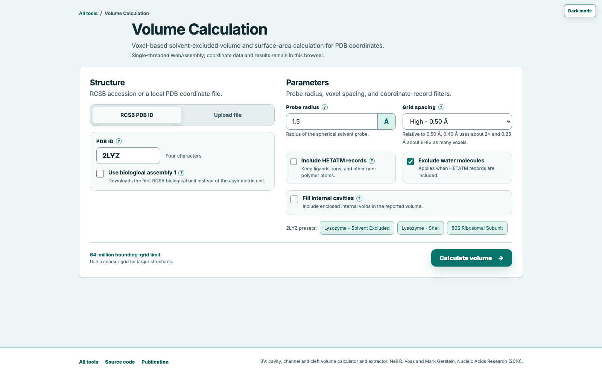
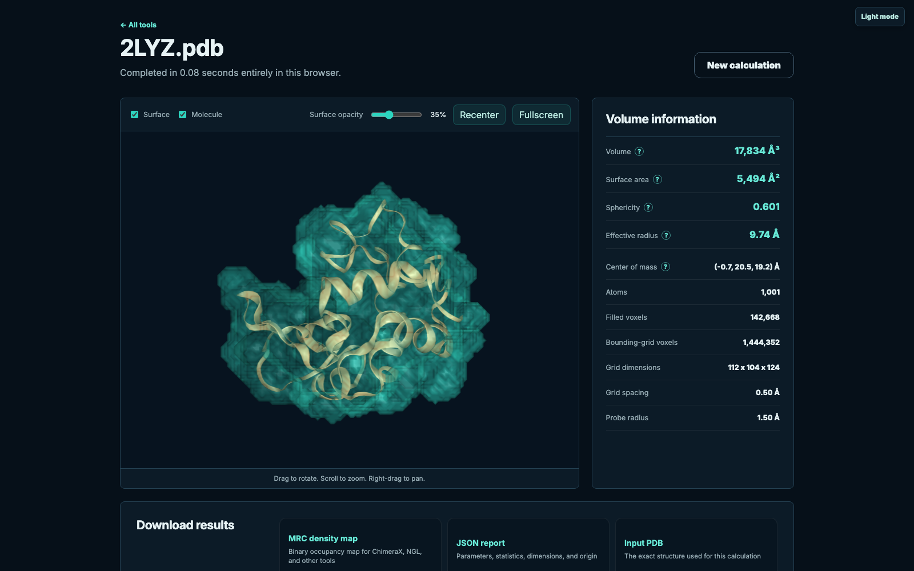
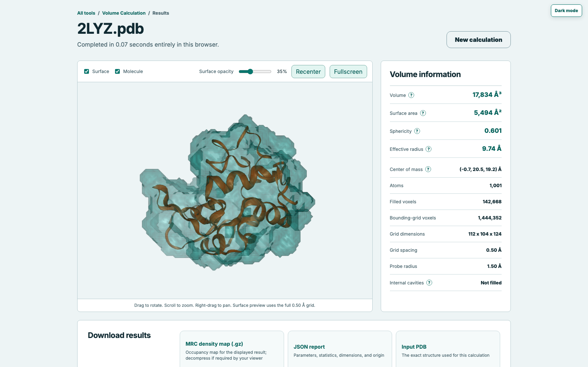

# 3vee molecular volume tools

Explore protein and RNA structure as molecular volume. Structural biologists can measure
solvent-excluded envelopes and extract internal solvent, channels, and the ribosomal exit tunnel
with Rust WebAssembly directly in the browser.

[Run 3V in your browser](https://vosslab.github.io/vossvolvox-pages/)

[Read the 3V publication](https://doi.org/10.1093/nar/gkq395)

All six public 3V procedures are available: Volume Calculation, Volume Range, Channel Finder,
Single Channel Extraction, Solvent Extraction, and Exit Tunnel Extraction.

## Why internal volume matters

Biomacromolecules are not solid objects. Deep clefts, pockets, cavities, channels, and chambers can
form binding sites, transport paths, and functional compartments. These spaces become especially
important in large protein and RNA assemblies, where visually tracing an internal region through
atomic coordinates is difficult.

3V converts atomic models into volumetric representations that can be measured, visualized, and
downloaded for further analysis. The method identifies internal space from the difference between
two rolling-probe molecular envelopes: a large-probe shell and a solvent-sized excluded surface.
The browser implementation provides both external-envelope calculations and the two-probe internal
volume procedures.

## From atoms to volume

3V applies the rolling-probe method on a three-dimensional voxel grid. Each atom begins as a van der
Waals sphere. A virtual spherical probe expands the accessible atomic volume, and contraction by the
same probe radius produces the solvent-excluded molecular envelope.

```text
PDB coordinates -> rolling probe -> voxel envelope -> volume, surface area, and shape
```

The probe represents the physical scale used to interrogate the structure:

- A 0 &Aring; probe approximates the van der Waals envelope.
- A 1.5 &Aring; probe represents water and gives a standard solvent-excluded envelope.
- A larger probe bridges narrow grooves and smooths the structure into a shell.
- A smaller probe follows finer clefts and surface detail.

Probe radius and grid spacing answer different questions. Probe radius defines which molecular
features are accessible at a chosen physical scale. Grid spacing controls how finely that surface is
sampled; a finer grid reduces voxel discretization without changing the probe itself.

## Two surfaces reveal inside

The complete 3V method compares two solvent-excluded surfaces:

```text
large-probe shell - solvent-probe molecular envelope = internal solvent volume
                                                          |
                              +---------------------------+----------------------+
                              |                                                  |
                         enclosed space                                exterior-connected
                            cavities                              channels, clefts, and pockets
```

The large probe creates a connected outer shell across surface openings. Subtracting the
solvent-probe envelope exposes space inside that shell that can accommodate the smaller probe.
Enclosed components are cavities; components connected to the exterior form the generalized channel
volume. Solvent Extraction returns the complete internal region, Single Channel Extraction follows
one coordinate-seeded component, and Channel Finder ranks connected components by accessible size.

Volume Calculation uses one probe at a time. Its **Fill internal cavities** option asks
whether enclosed voids should count as part of that one reported molecular envelope; it is distinct
from extracting and characterizing cavities as separate objects.

## See the molecular envelope

The site begins with the original division between external- and internal-volume tools, then guides
one structure from probe selection to an interactive molecule-and-surface result.

<!-- screenshots:begin (managed by screenshot-docs) -->

| View | Dark mode | Light mode |
| --- | --- | --- |
| Tool selector |  |  |
| Volume setup |  |  |
| 2LYZ result |  |  |
<!-- screenshots:end -->

## Lysozyme worked example

The browser workflow provides a ready-made solvent-excluded-volume example:

1. Select **Volume Calculation**.
2. Select **Lysozyme - Solvent Excluded** to load the 2LYZ preset.
3. Keep the 1.5 &Aring; probe and 0.5 &Aring; grid, then select **Calculate volume**.
4. Rotate the structure and compare the molecular ribbon with the translucent volume surface.

For the 2LYZ reference used in scientific parity testing, this calculation produces a volume of
17,833.500 &Aring;&sup3; and a surface area of 5,493.514 &Aring;&sup2;. The result demonstrates how
the solvent-sized probe converts atomic coordinates into a measurable molecular envelope.

Next, choose **Lysozyme - Shell**. Its 6 &Aring; probe bridges smaller surface depressions and produces
the smoother outer envelope used conceptually in the two-probe internal-volume method.

## Interpret the measurements

| Result | Structural meaning |
| --- | --- |
| Volume | Space enclosed by occupied voxels in the probe-derived envelope |
| Surface area | Area estimated from exposed voxel-face and edge configurations |
| Sphericity | Resemblance to a sphere, where 1.0 is a perfect sphere |
| Effective radius | Radius of a sphere with the same surface-area-to-volume ratio |
| Center | Average Cartesian position of occupied voxels |
| MRC map | Full-resolution occupancy volume for visualization or further analysis |

The interactive NGL view overlays calculated volumes with one molecular structure and one shared
camera. Volume Range defaults to the six 1 through 6 angstrom probe steps and shows every step as a
separately colored, selectable surface so the progression of smoothing can be inspected directly.
Channel Finder shows each ranked channel separately, reports its center of mass, and can carry a
safe coordinate directly into Single Channel Extraction.

Downloads include gzip-compressed MRC occupancy maps, the exact input PDB coordinates, and a JSON
report containing parameters and measurements. Volume Range and Channel Finder provide CSV tables,
stable color-to-layer mappings, and an individual MRC for every displayed result so the same
surfaces can be examined offline.

## Choose inputs deliberately

- **Coordinate set:** Select the biological assembly when the functional oligomer, rather than the
  crystallographic asymmetric unit, is the biological object of interest.
- **Atoms:** Decide whether ligands, ions, modified residues, and waters belong in the volume being
  measured. The HETATM and water controls make that choice explicit.
- **Probe radius:** Match the probe to the molecule or passage whose accessibility matters. Results
  at different probe sizes describe different surfaces.
- **Grid spacing:** Start coarse while exploring a large assembly, then refine the calculation when
  the surface and measurement need greater spatial resolution.
- **Cavity treatment:** Fill enclosed voids only when the scientific question calls for a solid
  outer molecular envelope.

The calculation describes one static coordinate model. Alternate conformations, molecular dynamics,
and experimental uncertainty require separate structures or analyses.

## Scientific browser workflow

- Select one of the six external- or internal-volume procedures.
- Retrieve an RCSB PDB entry or select a local PDB coordinate file.
- Choose the asymmetric unit or biological assembly and the atom records to include.
- Use Exit Tunnel Extraction only with deposited 1JJ2 coordinates; its fixed seed points come
  from Dr. Neil Voss's PhD thesis work and are specific to that H. marismortui 50S coordinate
  system.
- Calculate locally in a browser worker; an uploaded structure is not sent to a calculation server.
- Inspect volume, surface area, sphericity, effective radius, center, and calculation parameters.
- For internal tools, inspect accessible solvent measurements, ranked components, or the
  coordinate-seeded result.
- Compare the molecular model with its calculated surface in the NGL viewer.
- Export the full-resolution occupancy map, reproducible parameter report, and tabular series where
  applicable.

The browser edition is an independent WebAssembly implementation of 3V. It preserves the original
scientific method and tool organization while replacing server-side jobs with an immediate,
interactive workflow. Calculation variables and operation order track `vossvolvox-rust` where the
single-threaded browser environment permits.

Download results before leaving the page. The browser edition stores no job history.

## Documentation and citation

- [docs/GEOMETRY_MODEL.md](docs/GEOMETRY_MODEL.md) - Numerical definition of the voxel envelope,
  cavity treatment, coordinates, and output map.
- [docs/AUTHORS.md](docs/AUTHORS.md) - Scientific background and project authorship.
- [docs/CHANGELOG.md](docs/CHANGELOG.md) - Current capabilities, validation, and implementation
  history.
- [docs/DEVELOPMENT.md](docs/DEVELOPMENT.md) - Local builds, verification, benchmarks, resource
  limits, and deployment for maintainers.

If 3V contributes to a scientific analysis, cite:

> Voss NR, Gerstein M. 3V: cavity, channel and cleft volume calculator and extractor.
> *Nucleic Acids Research*. 2010;38:W555-W562.
> [doi:10.1093/nar/gkq395](https://doi.org/10.1093/nar/gkq395).

## License

The project is distributed under the
[GNU Lesser General Public License v3.0](LICENSE.LGPL-3.0.md).
